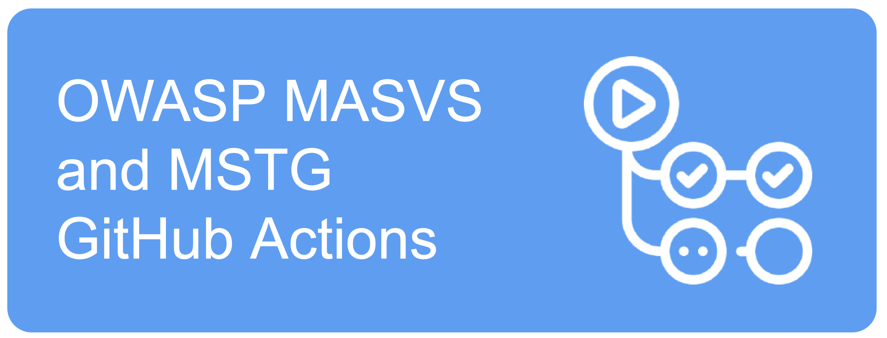

# Release Process

We use Github actions to build and verify the documents and to trigger releases. The output of a release is:

- The collection of [Release Assets](https://github.com/OWASP/owasp-masvs/releases) (incl. the MASVS in all languages and exported files such as YAML and CSV).
- The new version published on [GitBook](https://mobile-security.gitbook.io/masvs)

## How to Release

The CHANGELOG is handled *automagically* by GitHub. Still, step 1 you'll review the latest changes so that the Release Notes are meaningful and comprehensive.

1. Review the merged PRs since the last release, they should have:
   - Good titles (so you don't even have to open it to understand what has changed)
   - Appropriate tags (or the `ignore-for-release` tag to exclude it)
2. Checkout master and pull changes:

    ```bash
    git checkout master
    git pull
    ```

3. Push a tag with the new version (you must use semantic versioning!!):

    ```bash
    git tag -a v1.4.1 -m "Release v1.4.1"
    git push origin v1.4.1
    ```

4. Verify that the [Document Build Github Action](https://github.com/OWASP/owasp-masvs/actions/workflows/docgenerator.yml) was triggered. The Github action "Upload Release Asset" need to be triggered. This might take 5-10 minutes.
5. The **Release Draft** is ready, click on the edit icon:
    - review the generated log, include extra info if needed.
    - scroll to see all assets
    - check "Create a discussion for this release" so that it's announced in Discussions.
    - **Publish Release**

## Announcing the Release

1. Update OWASP Wiki if necessary.
2. Tweet about it with @OWASP-MSTG
3. Post on LinkedIn
4. Announce on OWASP Slack (owasp-community, leaders).

## GitBook Release

Currently using @sushi2k's repository (https://github.com/sushi2k/owasp-masvs which is synced automatically via https://github.com/apps/pull.

## Deleting a Release

In case something went wrong and we need to remove the release:

1. **Delete the Release Draft** in <https://github.com/OWASP/owasp-masvs/releases>.
2. **Delete the tag** locally and remotely:

    ```bash
    $ git tag -d v1.4.1   # delete the tag locally
    $ git push --delete origin v1.4.1  # delete the tag remotely
    ```